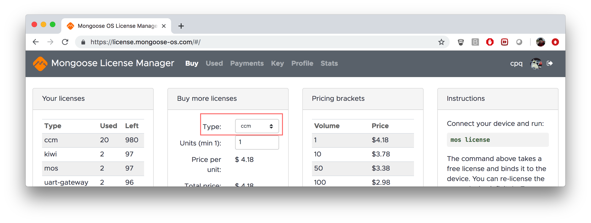

# Licensing

- Login to the [Mongoose License Manager](https://license.mongoose-os.com)
- Buy any number of "ccm" licenses you need. IMPORTANT: choose "ccm" license type:
  
- If your device is connected to your workstation over USB, run:
  ```
  mos license
  ```
- Or, if your device is accessible remotely, run:
  ```
  mos --port DEVICE_ADDRESS license
  ```

Licenses are bound to devices, and they are permanent.

The `mos license` command creates a unique license string specific
for a device,
and updates `device.license` configuration parameter, which "unlocks"
the device and removes restrictions. The License Manager decreases
the number of available licenses and saves a unique
license string. The next time `mos license` is run for the same device,
an old license string is returned by the License Manager
but the number of available licenses is not decreased.
Thus a device, once licensed, is licensed permanently.

