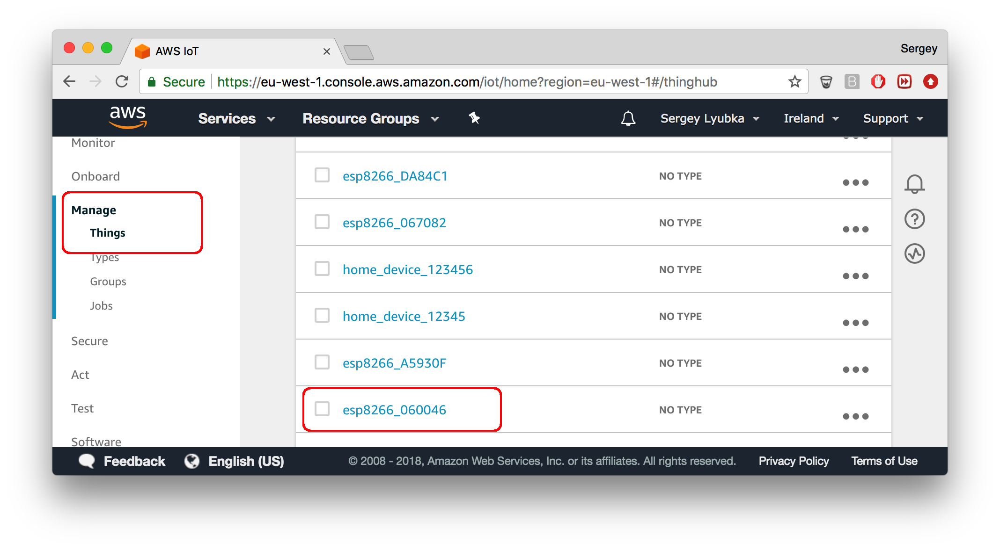

# Mongoose OS + AWS IoT

This tutorial demonstrates the following:

- How to build a skeleton for a commercial smart device, managed by AWS IoT
- Internet Button in 2 minutes
- How to control devices via AWS IoT device shadow
- How to report metrics data via AWS IoT
- How to perform OTA updates using AWS IoT device shadow

## Setup AWS IoT

- Install an [AWS CLI command line utility](https://aws.amazon.com/cli/)
- Follow the [AWS CLI configuration guide](http://docs.aws.amazon.com/cli/latest/userguide/cli-chap-getting-started.html) to setup your AWS credentials
- Verify your credentials setup. Start command prompt
  (or, terminal on Linux/Mac), enter the following command:
```
$ aws iot list-things
```
It must execute without errors.

## Setup device

- Follow [mos tool setup instructions](/software.html) to install `mos` tool
- Pick one of the supported devices. We suggest to choose from [recommended devboards](../quickstart/devboards.md)
- Connect your device to your workstation with a USB cable
- Flash a pre-built [demo-js](https://github.com/mongoose-os-apps/demo-js)
  firmware:
```bash
mos flash YOUR_PLATFORM  # e.g. stm32, esp32, esp8266, cc3220
```
- Configure WiFi on a device
```
mos wifi WIFI_NETWORK WIFI_PASSWORD
```
- Provision your device to Azure IoT with a single command:
```
mos aws-iot-setup --aws-region YOUR_AWS_REGION
```
This command performs certificate management for you, and
onboard your device on AWS IoT cloud. If your device has an
[Atmel ECC508A](http://www.atmel.com/devices/ATECC508A.aspx) secure element
attached, then Mongoose Firmware will use ECC508A chip for TLS handshake
and keep your credentials secure. 

Open AWS console, "IoT Core" service, and find your provisioned device in
the list. On the picture, ESP8266 was used.




<div class="clearfix"></div>

## Internet button in 2 minutes

Check out a video below that shows how to implement Internet button
functionality on AWS IoT in less than 2 minutes:

<iframe src="https://www.youtube.com/embed/nA3tGsSFngc"
 style="width:560px; height:315px;"
 frameborder="0" allowfullscreen></iframe>


## Controlling LED using AWS device shadow

Start your favorite editor, create a file called `init.js`, copy-paste
the following snippet and save:

```javascript
load('api_config.js');
load('api_gpio.js');
load('api_shadow.js');

let led = Cfg.get('pins.led');  // Built-in LED GPIO number
let state = {on: false};        // Device state - LED on/off status

// Set up Shadow handler to synchronise device state with the shadow state
Shadow.addHandler(function(event, obj) {
  if (event === 'CONNECTED') {
    // Connected to shadow - report our current state.
    Shadow.update(0, state);
  } else if (event === 'UPDATE_DELTA') {
    // Got delta. Iterate over the delta keys, handle those we know about.
    print('Got delta:', JSON.stringify(obj));
    for (let key in obj) {
      if (key === 'on') {
        // Shadow wants us to change local state - do it.
        state.on = obj.on;
        GPIO.set_mode(led, GPIO.MODE_OUTPUT);
        GPIO.write(led, state.on ? 1 : 0);
        print('LED on ->', state.on);
      }
    }
    // Once we've done synchronising with the shadow, report our state.
    Shadow.update(0, state);
  }
});
```

This snippet makes a device controllable by the device shadow, by synchronising
the `on` attribute in the shadow with the LED status: if `on` is `true`,
the LED is turned on, and if `on` is `false`, it is turned off. That is done
by handling `Shadow.UPDATE_DELTA` event, which is generated every time
the `desired` attributes of the shadow are different from the `reported` attributes.

In the command prompt (or terminal on Linux/Mac), enter the following commands
to copy `init.js` to the device, reboot the device, and start monitoring
serial output:

```
mos put init.js
mos call Sys.Reboot
mos console 
```

<video controls="" class="float-right border w-50 m-3">
    <source src="images/aws1.mp4" type="video/mp4">
</video>


On the AWS console, click on the device ID, choose "Shadow" tab. Click
on "Edit" to modify shadow, and add the `desired` section:

```json
{
  "desired": {
    "on": true
  },
  ...
}
```

Click "Save". Click on "Edit" again, change `on` to `false`. Click "Save".
See device logs, and see how LED turns on and off. NOTE: on some boards,
(notably, Espressif) LED pins are inverted, therefore LED turns on when
`on` is `false`, and turns off when `on` is `true`.


## Reporting metrics to AWS IoT

We'll report free RAM metric using MQTT API. Note that AWS IoT has
versatile rules engine, which allows to handle incoming MQTT messages in
a various ways: store in Dynamo DB, forward to your Lambda function, etc etc.

Again, create `init.js` file in your favorite editor with the following content:

```javascript
load('api_config.js');
load('api_mqtt.js');
load('api_sys.js');
load('api_timer.js');

let topic = 'metrics/' + Cfg.get('device.id');

Timer.set(1000 /* milliseconds */, Timer.REPEAT, function() {
  let msg = JSON.stringify({free: Sys.free_ram(), total: Sys.total_ram()});
  print(topic, '->', msg);
  MQTT.pub(topic, msg, 1);
}, null);
```

<video controls="" class="float-right border w-50 m-3">
    <source src="images/aws2.mp4" type="video/mp4">
</video>

In the command prompt (or terminal on Linux/Mac), enter the following commands
to copy `init.js` to the device, reboot the device, and start monitoring
serial output:

```
mos put init.js
mos call Sys.Reboot
mos console
```

In the AWS IoT console, click on "Test". Into the "Subscription topic" field,
enter `metrics/#` and click "Subscribe to topic". See how messages are
coming.


## Direct device control via AWS IoT

If you're using Bash shell, you can use this alias to talk to your
device interactively via AWS IoT:

<pre class="command-line language-bash" data-user="chris" data-host="localhost" data-output="3-100"><code>alias mos1="mos --cert-file $(mos config-get mqtt.ssl_cert) --key-file $(mos config-get mqtt.ssl_key) --port mqtts://$(mos config-get mqtt.server)/$(mos config-get device.id)"
mos1 ls -l
init.js 330
index.html 250
...</code></pre>

For more in-depth explanation, see
[Secure remote device management with Mongoose OS](https://mongoose-os.com/blog/secure-remote-device-management-with-mongoose-os-and-aws-iot-for-esp32-esp8266-ti-cc3200-stm32/)
blog post.

## OTA update via AWS IoT device shadow

TBD


## Using AWS IoT in your custom firmware

The AWS IoT integration described above is implemented by the
[aws](https://github.com/mongoose-os-libs/aws) Mongoose OS library.

It provides device shadow API in both C/C++ and JavaScript, allowing
developers to quickly prototype the device logic in JS before jumping to the
C/C++ implementation.

Also, MQTT API is available, also for both C/C++ and JavaScript.

In order to have AWS IoT functionality in your custom application,
just add `aws` library to your `mos.yml` file:

```yaml
libs:
  ...
  - origin: https://github.com/mongoose-os-libs/aws  # <-- Add this!
```

Then, rebuild your app:

```
mos build
```
