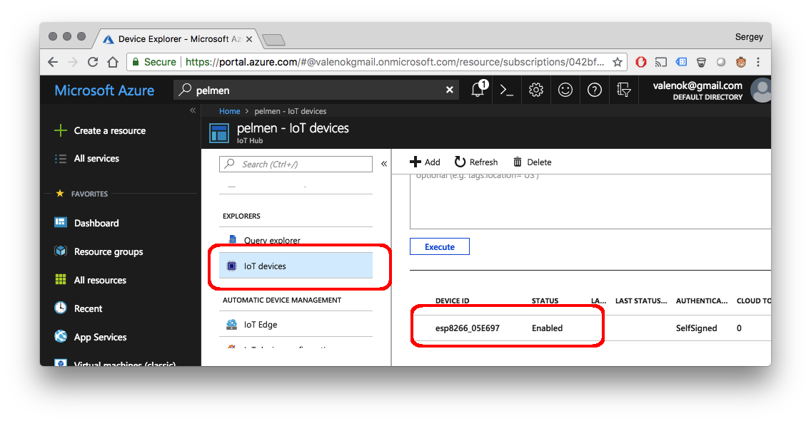
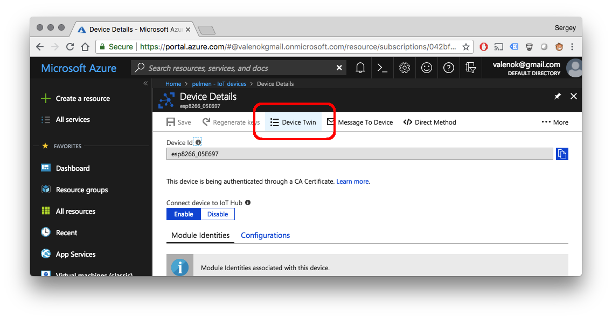

# Mongoose OS + Azure IoT tutorial

This tutorial demonstrates the following:

- How to build a skeleton for a commercial smart device, managed by Azure IoT
- How to reuse the code for different hardware platforms
- How to use Azure IoT device twin
- How to use Azure IoT device configuration
- How to perform bulk OTA updates using Azure device management


## Setup Azure IoT

- Create an account on [portal.azure.com](http://portal.azure.com)
- Install `az`, an Azure command line utility, by [following these instructions](https://docs.microsoft.com/en-us/cli/azure/install-azure-cli?view=azure-cli-latest")
- Start command prompt (or terminal on UNIX/Mac), login and follow the instructions:
```
az login
```
- Create an IoT hub. Note:
   * Use EU-West region (this is important, since not all regions have IoT device configuration enabled)
   * Choose standard pricing tier


## Setup devices

- Follow [mos tool setup instructions](/software.html) to install `mos` tool
- Pick one of the supported devices. We suggest to choose from [recommended devboards](../quickstart/devboards.md)
- Connect your device to your workstation via USB
- Clone, build and flash the firmware:

```bash
git clone https://github.com/mongoose-os-apps/demo-js
cd demo-js
mos build --platform YOUR_PLATFORM  # e.g. stm32, esp32, esp8266, cc3220
mos flash
```

- Configure WiFi on a device

```
mos wifi WIFI_NETWORK WIFI_PASSWORD
```

- Provision your device to Azure IoT with a single command:

```
mos azure-iot-setup --azure-hub-name YOUR_AZURE_HUB_NAME
```

A newly provisioned device must appear in the hub's device list. In the
example, an ESP8266 board is used. You will get a different devie ID,
according to the hardware platform you're using.



## Controlling device using Azure device twin

Click on the device ID shown in the device list, then click on a
"Device twin" tab:



That should bring us to the shadow editor:


Start your favorite editor, create a file called `init.js`, copy-paste
the following snippet and save:

```javascript
load('api_config.js');
load('api_gpio.js');
load('api_shadow.js');

let led = Cfg.get('pins.led');  // Built-in LED GPIO number
let state = {on: false};        // Device state - LED on/off status

// Set up Shadow handler to synchronise device state with the shadow state
Shadow.addHandler(function(event, obj) {
  if (event === 'CONNECTED') {
    // Connected to shadow - report our current state.
    Shadow.update(0, state);
  } else if (event === 'UPDATE_DELTA') {
    // Got delta. Iterate over the delta keys, handle those we know about.
    print('Got delta:', JSON.stringify(obj));
    for (let key in obj) {
      if (key === 'on') {
        // Shadow wants us to change local state - do it.
        state.on = obj.on;
        GPIO.set_mode(led, GPIO.MODE_OUTPUT);
        GPIO.write(led, state.on ? 1 : 0);
        print('LED on ->', state.on);
      } else {
        print('Dont know how to handle key', key);
      }
    }
    // Once we've done synchronising with the shadow, report our state.
    Shadow.update(0, state);
  }
});
```

This snippet makes a device controllable by the device twin.


In the command prompt (or terminal on Linux/Mac), enter the following commands
to copy `init.js` to the device, reboot the device, and start monitoring
serial output:

```
mos put init.js
mos call Sys.Reboot
mos console 
```

In the device twin editor, add `desired.on` boolean key. Set it to `true` or
`false`, and observe how the device reacts by switching the LED on/off:

<video controls="" class="text-center border w-75 my-2">
    <source src="images/azure5.mp4" type="video/mp4">
</video>
