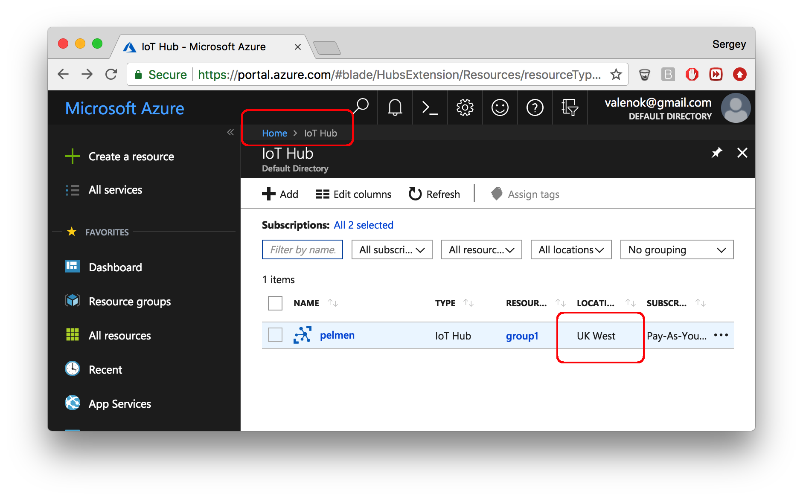

# Mongoose OS + Azure IoT tutorial

This tutorial demonstrates the following:

- How to build a skeleton for a commercial smart device, managed by Azure IoT
- How to reuse the code for different hardware platforms
- How to use Azure IoT device twin
- How to use Azure IoT device configuration
- How to perform bulk OTA updates using Azure device management

## Setup Azure IoT

<!--  -->

- Create an account on [portal.azure.com](http://portal.azure.com)
- Install `az`, an Azure command line utility, by [following these instructions](https://docs.microsoft.com/en-us/cli/azure/install-azure-cli?view=azure-cli-latest")
- Create an IoT hub. Note:
   * Use EU-West region (this is important, since not all regions have IoT device configuration enabled)
   * Choose standard pricing tier

## Setup devices

- Pick one of the supported devices. We suggest to choose from [recommended devboards](../quickstart/devboards.md)

