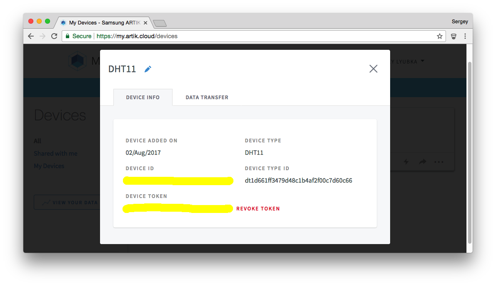
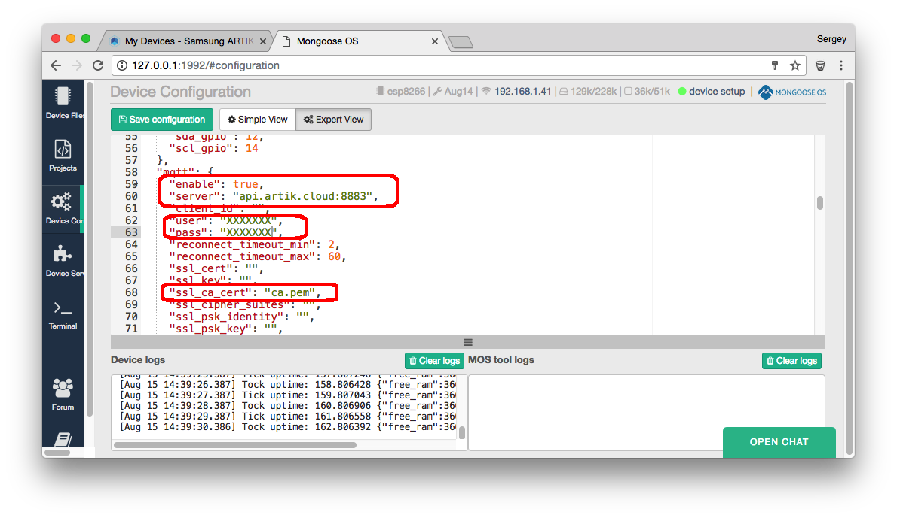

# Samsung Artik Cloud

In order to use Samsung Artik Cloud service, a "Generic MQTT server"
library is required. The sequence of steps to onboard with Artik Cloud
is outlined below.

## Prerequisites:

- ESP8266 NodeMCU or ESP32 development boards
- Samsung Artik Cloud account

## Onboarding sequence

#### Install Mongoose OS
Run `mos` tool, install Mongoose OS and set up WiFi

#### Login to Artik Cloud and create a device with type DHT11


#### Generate device token

Click on the device, generate device token



#### Configure device

Open device configuration in the Web UI, click on Expert View,
and set the following fields (use your specific device ID and token):

- `mqtt.enable=true`
- `mqtt.server=api.artik.cloud:8883`
- `mqtt.user=YOUR_DEVICE_ID`
- `mqtt.pass=YOUR_DEVICE_TOKEN`
- `mqtt.ssl_ca_cert=ca.pem`



#### Make device report data

Open Device Files tab, click on `init.js` file. Paste this code
that sends fake temperature/humidity data to the cloud:

```javascript
load('api_config.js');
load('api_mqtt.js');
load('api_sys.js');
load('api_timer.js');

let sdid = Cfg.get('mqtt.user');
let topic = '/v1.1/messages/' + sdid;

Timer.set(1000, true, function() {
  let data = {temperature:24, humidity:Sys.free_ram()};
  let ok = MQTT.pub(topic, JSON.stringify(data), 1);
  print('Published', ok, JSON.stringify(data));
}, null);
```

Click 'Save + Reboot' button

#### Graph reported data

Click on CHARTS tab in Artik Cloud console.
Add graph for DHT11 device, humidity - in reality, that reports free RAM.


#### Summary

The process above shows how to use Samsung Artik Cloud to authorise
devices and report data via MQTT.
