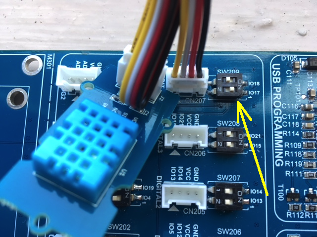

# MakerFactory board + Mongoose OS

This tutorial demonstrates how to use Mongoose OS on MakerFactory ESP32
development board, and use Google IoT core as a cloud backed to
control the board and report metrics.

## Setup the board and Google IoT Core

Please follow [Google IoT Core tutorial](../cloud/google.md)
in order to setup the cloud side and provision your board to Google IoT Core.

<video controls="" class="float-right border w-50 p-3">
    <source src="images/mf1.mp4" type="video/mp4">
</video>

NOTE: before executing `mos flash` command, press and hold
`IO0` button on the board in order to enter programming mode. That needs
to be done every time you flash the board.

HINT FOR THE MANUFACTURER:
in order to omit manual button press, modify USB-to-Serial adapter wiring by connecting
DTR to GPIO0 and RTS to RESET. See notes from Espressif at
https://github.com/espressif/esptool/wiki/ESP8266-Boot-Mode-Selection#automatic-bootloader


## Controlling LED via Google IoT Core

Open `fs/init.js` in your favorite editor, copy-paste the following snippet and save:

```javascript
load('api_config.js');
load('api_gpio.js');
load('api_mqtt.js');
load('api_neopixel.js');

let strip = NeoPixel.create(33, 2, NeoPixel.GRB);
strip.clear();

let topic = '/devices/' + Cfg.get('device.id') + '/config';
MQTT.sub(topic, function(conn, topic, msg) {
  print('Topic:', topic, 'message:', msg);
  // Expected config format: {"led": 0, "r": 123, "g": 123, "b":123}
  let obj = JSON.parse(msg) || {};
  strip.setPixel(0, obj.r || 0, obj.g || 0, obj.b || 0);
  strip.show();
}, null);
```

The snippet above initialises RGB LED strip, and subscribes to the
`/config` object notifications. Once the config object is sent to device
by Google IoT Core, the handler function is called and lights the
corresponding LED.

In the command prompt (or terminal on Linux/Mac), enter the following commands
to copy `init.js` to the device, reboot the device, and start monitoring
serial output:

```
mos put fs/init.js
mos call Sys.Reboot
mos console
```

<video controls="" class="float-right border w-50 p-3">
    <source src="images/mf2.mp4" type="video/mp4">
</video>


Find a registered device in a Google IoT Core device registry.
Click on "Update Config" button, and in the opened dialog, enter
the following configuration and hit "SEND TO DEVICE":

```json
{"r": 50, "g": 0, "b": 0}
```

Note how one of the LEDs turns red. Enter

```json
{"r": 0, "g": 0, "b": 0}
```

Note how the LED turns off.

Important thing to note: Google IoT Core send device config object
each time device comes online or a config change is made. That means,
that if you power cycle the device, it'll sync its LED state with the
cloud as soon as it gets connected.


## Sending metrics to Google IoT Core



We are going to connect a Grove DHT temperature sensor to the board,
then modify `fs/init.js` to periodically read the temperature and send
it over to the Google IoT Core.

Get the Grove DHT sensor and connect it to the IO17 Grove connector
on the board, as shown on the picture.

The DHT driver is built-in to the `demo-js` app we're using, therefore
we do not need to rebuild the firmware.

Open `fs/init.js` in your favorite editor, copy-paste the following snippet and save:

```javascript
load('api_config.js');
load('api_dht.js');
load('api_mqtt.js');
load('api_timer.js');

let topic = '/devices/' + Cfg.get('device.id') + '/state';
let pin = 17;  // GPIO pin which has a DHT sensor data wire connected
let dht = DHT.create(pin, DHT.DHT11);  // Initialize DHT library

Timer.set(3000 /* milliseconds */, Timer.REPEAT, function() {
  let t = dht.getTemp();
  let h = dht.getHumidity();
  if (isNaN(h) || isNaN(t)) {
    print('Failed to read data from sensor');
  } else {
    let msg = JSON.stringify({temperature: t, humidity: h});
    print(topic, '->', msg);
    MQTT.pub(topic, msg, 1);
  }
}, null);
```

<video controls="" class="float-right border w-50 m-3 p-0">
    <source src="images/mf4.mp4" type="video/mp4">
</video>


In the command prompt (or terminal on Linux/Mac), enter the following commands
to copy `init.js` to the device, reboot the device, and start monitoring
serial output:

```
mos put fs/init.js
mos call Sys.Reboot
mos console
```

In the Google IoT Web console, click on the "Configuration and state history",
and see how new state objects are arriving. Click on any state object,
select "text" view, and check the JSON string that is sent by device.
