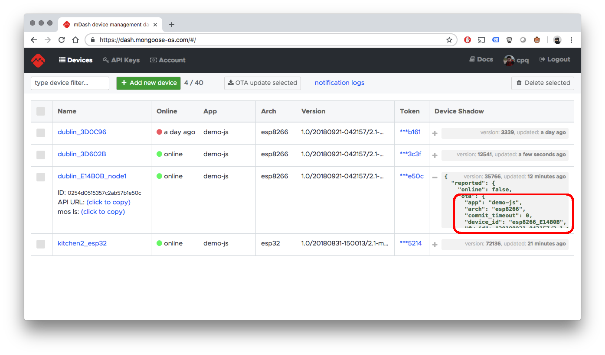

# Technical overview

A configured device connects to the dashboard over the secure Websocket,
sending a `Authorization: Bearer GENERATED_TOKEN` handshake header.
After the successful handshake, all communication is done via the
JSON-RPC 2.0 protocol. Each RPC frame wrapped into the Websocket frame.

The RESTful API endpoints that the dashboard exports start with
`/api/v2/`. The endpoints that for the individual device start with
`/api/v2/devices/:id`, where `:id` is the unique device ID, generated at
the device registration together with the access token.

The dashboard gives a RESTful access to all RPC services exported by the device.
Thus, the dashboard acts as a JSON-RPC / RESTful bridge. The device's
RPC methods are mapped to `/api/v2/devices/:id/rpc/:method`  endpoints.
If the RPC endpoint does not accept any parameters, you cat use `GET` HTTP
method. If it does, `POST` must be used. The parameters should be a JSON
string, and the `Content-Type: application/json` header must be set, e.g.:

```
curl \
  -H 'Content-Type: application/json' \
  -H 'Authorization: Bearer API_KEY' \
  -d '{"pin": 2}' \
  http://dash.mongoose-os.com/api/v2/devices/DEVICE_ID/rpc/GPIO.Toggle
```

When a device comes online, the `dash` library that is responsible for the
dashboard connection, sends a shadow update message with the information
about the device: architecture, firmware version, etc:


