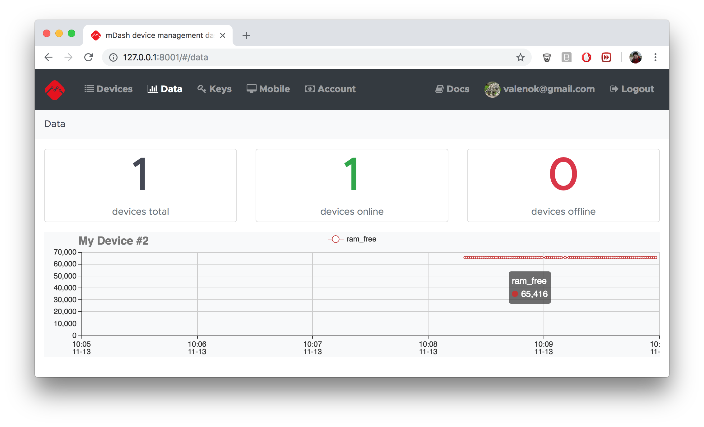

# Data logging and visualisation

mDash provides an experimental support for data logging
and visualisation:



## How to log data from a device

Device logs data via the device shadow update. Here how it is done in C/C++:

```c
#include "mgos.h"
#include "mgos_shadow.h"  // make sure to include "shadow" lib in mos.yml

// Somewhere in your code ...
mgos_shadow_updatef(0, "{my_value: %g}", 1.2345);
```

And in JavaScript:

```javascript
load('api_shadow');

// Somewhere in your code ...
Shadow.update(0, JSON.stringify({my_value: 1.2345}));
```

See [Device shadow](shadow.md) section for the detailed device shadow
explanation.

## How to enable data log on mDash

mDash can be instructed to save certain device shadow values into a
persistant database. Currently, up to 100 data points can be saved.
In the future, the number of datapoints will be unlimited.

In order to select which device shadow values get logged, modify the
`tags.save` array, which is the array of shadow keys to log.
By default, it is set to save only `ram_free` metric. That metric gets
reported by the `demo-js` default firmware.

On mDash, click on the device name. In the device shadow editor, edit
the `tags` value and save:

```javascript
  ...
  "tags": {
    "save": [
      "ram_free"
    ]
  },
  ...
```
