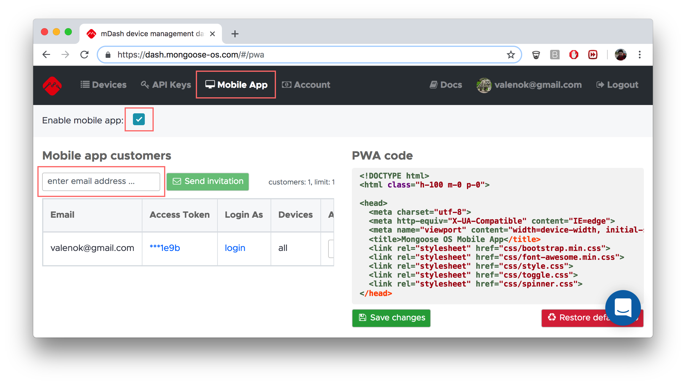
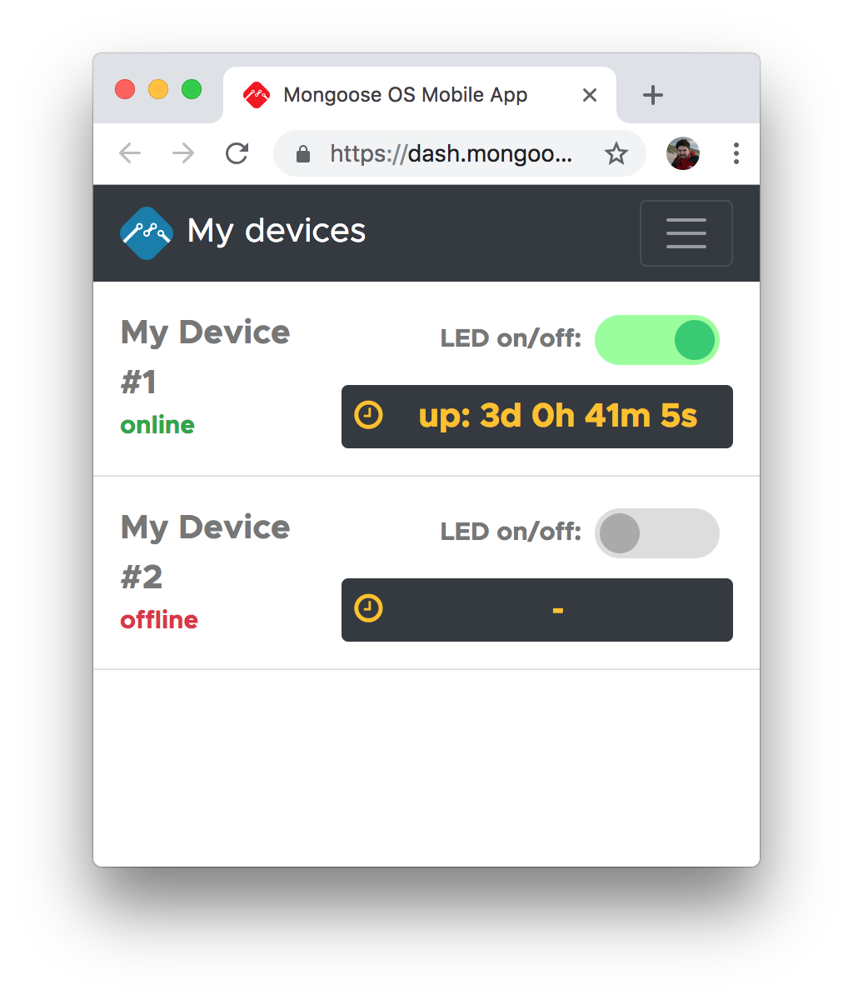
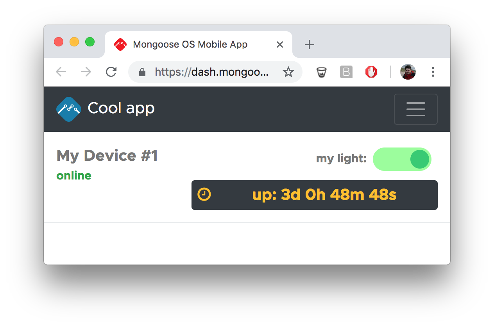
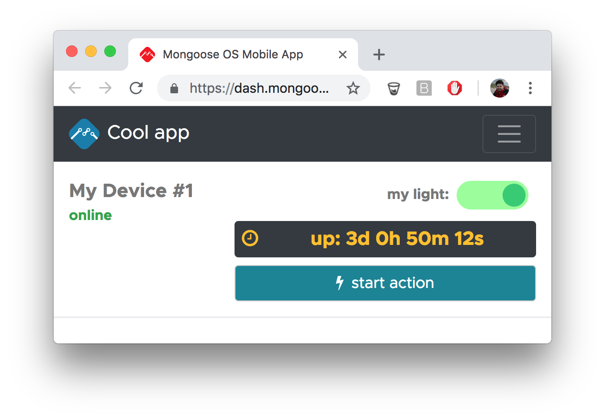

# Mobile app



For every registered user, mDash serves custom Progressive Web App (PWA).
This gives an ability to manage user's devices via a mobile phone.
In order to enable PWA,
   
- Choose "Mobile App" in the menu
- Tick the "Enable mobile app" checkbox
- Enter your email address and press on "Send invitation" button

That creates a built-in mobile app for the whole fleet of devices.

## Customizing built-in app




The default app is customisable. It displays a list of devices shared with
the particular mobile app customer, and for each device, displays a list
of control widgets. The information displayed by each widget is based on a
device shadow. Read-only widgets just display certain shadow values, and
"actuator" widgets (swithes, buttons) modify shadow values. All device
changes are caught via the websocket notifications, and displayed real-time.

The look and feel of the built-in app could be customised in by changing
the `var ui = { ... };` object in the PWA code. This is the default value:

```javascript
  var ui = {
    title: 'My devices',
    // icon: 'fa-save',
    controls: [
      { path: 'on', type: 'toggle', title: 'LED on/off:' },
      { path: 'uptime', type: 'value', format: 'up:  %D', icon: 'fa-clock-o' },
    ],
  };
```

As you see, you could modify app's title, menu icon,
and define an arbitrary number of control widgets. The description of
the available widgets is below.

### Toggle button

```javascript
{ path: 'SHADOW_KEY', type: 'toggle', title: 'YOUR TITLE' }
```


Renders a toggle button with a label. A shadow key points to a boolean `true/false`.

Example:

```javascript
var ui = {
  title: 'Cool app',
  controls: [
    { path: 'on', type: 'toggle', title: 'my light:' },
  ],
};
```

### Value

```javascript
{ path: 'SHADOW_KEY', type: 'value', icon: 'fa-save', format: '', title: 'hello' }
```



Renders shadow value. `icon` is optional, could be a font-awesome class, e.g. `fa-save`,
or an inline base64-encoded icon data. The format could be:
- `%D` expects a number of seconds, converts it to a `Xd Xh Xm Xs`.
- `%.Nf` formats floating-point value, e.g. `%.1f` leaves one digits after comma.

Example:

```javascript
var ui = {
  title: 'Cool app',
  controls: [
    { path: 'on', type: 'toggle', title: 'my light:' },
    { path: 'uptime', type: 'value', title: 'up:', icon: 'fa-clock-o', format: 'up: %D' },
  ],
};
```

### Push button

```javascript
{ path: 'SHADOW_KEY', type: 'button', icon: 'fa-save', title: 'hello' }
```



Renders a push button. `icon` is optional, could be a font-awesome class, e.g. `fa-save`,
or an inline base64-encoded icon data. The shadow value must be an numeric value. Pushing
a button will increment it and set incremented value in `desired`.

Example:
```javascript
var ui = {
  title: 'Cool app',
  controls: [
    { path: 'on', type: 'toggle', title: 'my light:' },
    { path: 'uptime', type: 'value', title: 'up:', icon: 'fa-clock-o', format: 'up: %D' },
    { path: 'v1', type: 'button', title: 'start action', icon: 'fa-flash' },
  ],
};
```

## Fully custom app

You can save your own code and totally modify the look and feel of the app.
If you do so, you can always restore the built-in app by pressing the
"Restore default app" button.

## Mobile app API

mDash exports a different set of RESTful API to the mobile app. Mobile app
API allows to get a list of devices, and render the UI according to their shadows.

| Method | Endpoint         | Params | Description |
| ------ | ---------------- | ------ | ----------- |
| GET    | /api/v2/appuser  | &nbsp; | Get list of devices |
| POST   | /api/v2/appuser/device/:id  | {shadow} | Update device shadow |
| WSS    | /api/v2/appuser/ws         | &nbsp; | Websocket notification URI |
