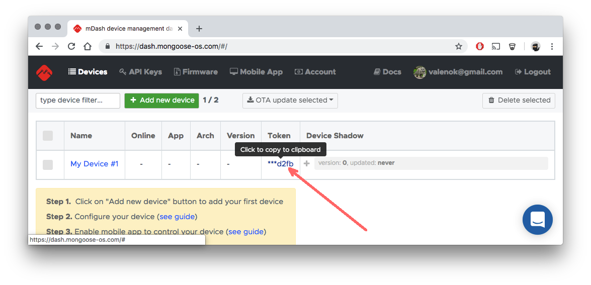

# Device registration

**Step 1.** Make sure you have `mos` tool installed - see [mos tool setup](../quickstart/setup.md)

**Step 2.** Flash an app to your device. If you already have an
app flashed, skip this step. Otherwise, flash a pre-built demo
app: `mos flash YOUR_PLATFORM`, for example `mos flash esp32`

**Step 3.** Congifure WiFi: `mos wifi NETWORK_NAME NETWORK_PASSWORD`



**Step 4.** Login to the https://dash.mongoose-os.com/, register a new device.
Click on a "Token" link  to copy it to the clipboard.

<div class="w-100 clearfix" />

**Step 5.** Configure device:

```
mos config-set dash.enable=true dash.token=TOKEN
```

Done! Now your device should appear "green" (online) on a dashboard.


### Troubleshooting

If `mos config-set` command on Step 5 fails for you, complaining
about non-existing variables, then your app needs to be rebuilt with the
`dash` library. Edit your app's `mos.yml`:

```yaml
libs:
  ...
  - origin: https://github.com/mongoose-os-libs/dash  # <-- Add this line!
```

Then, `mos build`, `mos flash`, and repeat registration from Step 3.


## Using device simulator

If you don't want to use a real device for some reason, there
is a POSIX program for Linux/Mac/Windows that could be used to simulate
the device. Clone it from
[https://github.com/cesanta/mongoose-os-device-simulator](https://github.com/cesanta/mongoose-os-device-simulator).

Then simply run `make`. You'll the the access token prompt:

```
$ make
cc -W -Wall -g -O2 -D MG_ENABLE_CALLBACK_USERDATA=1 -D MG_ENABLE_SSL -DMG_SSL_IF=MG_SSL_IF_MBEDTLS -lmbedtls -lmbedcrypto -lmbedx509 main.c mongoose.c -o simulator
./simulator
Enter access token: 
```

Login to [dash.mongoose-os.com](https://dash.mongoose-os.com), choose some
registered device, copy the
access token to the clipboard, paste into the prompt and press enter.

