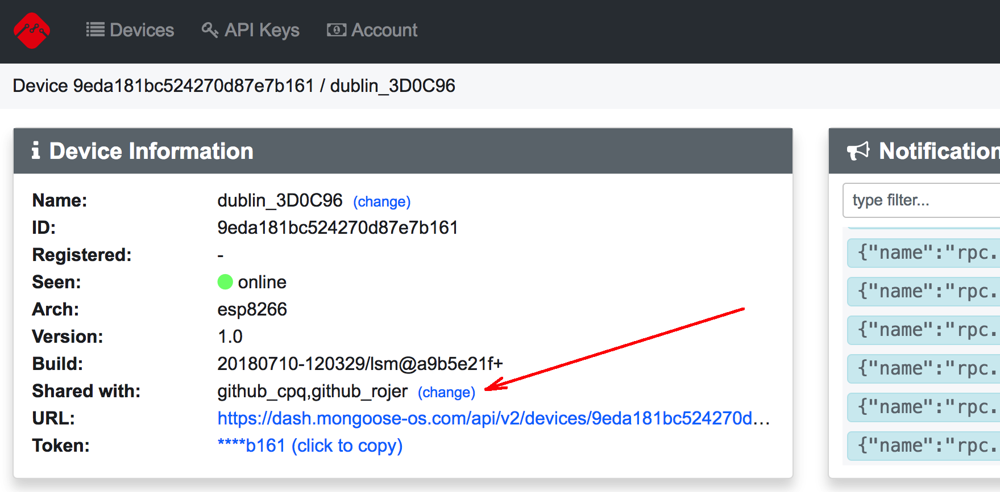
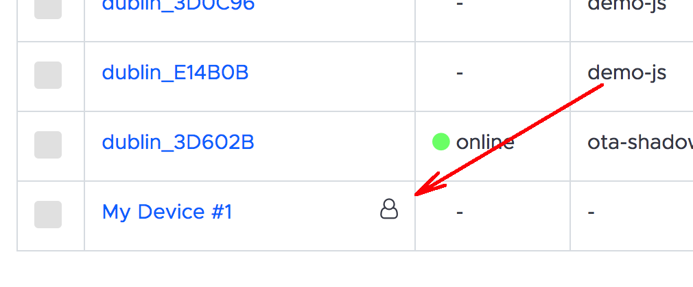

# Device sharing

It is possible to share a device with other users. This is driven by the
`shared_with` property of the device, which is a comma-separated
string of user IDs to share device with. The `shared_with` property could be
set via the API, or via the dashboard's "Info" panel:

Shared devices are marked with  a user icon in the device list:

In order to see your user ID, click on the Account tab:
