# Mongoose OS quick start quide

A 12-minute guide to turn your device into a mobile-controllable,
updatable, remotely manageable, secure, configurable product.

<div class="row">
  <div class="col-md-4">
    <div><a href="#1-download-and-install-mos-tool">1. Download and install [1min]</a></div>
    <div><a href="#2-start-mos-tool">2. Start mos tool [0 min]</a></div>
    <div><a href="#3-usb-to-serial-drivers">3. Install drivers [2 min]</a></div>
    <div><a href="#4-create-new-app">4. Create new app [1 min]</a></div>
  </div>
  <div class="col-md-4">
    <div><a href="#5-build-app-firmware">5. Build app firmware [1 min]</a></div>
    <div><a href="#6-flash-firmware">6. Flash firmware [1 min]</a></div>
    <div><a href="#7-configure-wifi">7. Configure WiFi [0 min]</a></div>
    <div><a href="#8-add-device-to-the-mdash-management-dashboard">8. Register on mDash [1 min]</a></div>
  </div>
  <div class="col-md-4">
    <div><a href="#9-make-changes-to-the-firmware">9. Change firmware [2 min]</a></div>
    <div><a href="#10-update-firmware-over-the-air">10. Update over-the-air [2 min]</a></div>
  </div>
</div>

## 1. Download and install mos tool

Mongoose OS uses `mos` tool for various tasks:
building firmware, flashing firmware,
managing device, provisioning device on cloud services, and so on.

|  OS |  Setup instructions | 
| --- | ------------------- |
| Windows | Create `C:\mos` folder. Right-click on this [mos.exe](https://mongoose-os.com/downloads/mos-release/win/mos.exe) link,  choose "Save link as", save `mos.exe` into the `C:\mos` folder. Double-click on `mos.exe` to start a Web UI. If it does not start, open command prompt, enter <code>cd c:\mos</code> and then <code>mos --start-webview=false</code>|
|  MacOS | First, [install brew utility](https://brew.sh/). Then execute the following to start a Web UI: <pre>brew tap cesanta/mos<br>brew install mos<br>mos</pre> |
|  Ubuntu Linux | Note: Linux version starts UI in a browser window. <pre>sudo add-apt-repository ppa:mongoose-os/mos<br>sudo apt-get update<br>sudo apt-get install mos<br>mos</pre> |
|  Arch Linux | Note: Linux version start UI in a browser window. <pre>git clone https://github.com/cesanta/mos-tool<br>cd mos-tool/mos/archlinux_pkgbuild/mos-release<br>makepkg<br>pacman -U ./mos-*.tar.xz<br>mos</pre> |
|  Generic MacOS/Linux | Note: starts UI in a browser window. <pre>curl -fsSL https://mongoose-os.com/downloads/mos/install.sh \| /bin/bash<br>mos</pre> |

## 2. Start mos tool

Make sure your device is connected via the USB to your workstation.

Completing previous section should leave you with the `mos` Web UI running:


Note: if you like using command prompt / terminal instead of the UI,
you can execute `mos` commands in a command prompt instead.
The Web UI appears only when `mos` tool is started without arguments.
On Windows and Mac, closing the Web UI window also terminates the `mos` command.
On Linux, the Web UI is started in a browser, so to stop it, close the
browser window and pressing `Ctrl-C` in a terminal where `mos` is running.


## 3. USB-to-Serial drivers

If you have your device connected via the USB, the UI can still
complain about the unavailable ports like this:


The most usual reason for this is a missing USB-to-Serial driver. Below are
the links to the driver installation pages. Install the driver, and re-insert
your device into the USB. 

- [Silabs drivers](https://www.silabs.com/products/development-tools/software/usb-to-uart-bridge-vcp-drivers) for Espressif boards
- [CH43x drivers](https://github.com/adrianmihalko/ch340g-ch34g-ch34x-mac-os-x-driver) for Espressif boards
- [FTDI drivers](https://www.ftdichip.com/Drivers/VCP.htm) for CC3200, CC3220

In a "Choose port" dropdown, at least one port must appear.


NOTE: on some Mac computers, the port might not show up even after the
driver is installed. The possible reason could be the extension policy,
the fix is covered in [this issue](https://github.com/tekezo/Karabiner-Elements/issues/777#issuecomment-312400158)

## 4. Create new app

In the UI, select your board from the dropdown menu. Then, press `Ctrl-n`
to create a new app. That will paste the following command:

```
mos clone https://github.com/mongoose-os-apps/demo-js app1
```


Press Enter. That is going to clone `demo-js` repo into the `app1` directory.
Notice how current directory changes to `app1`:

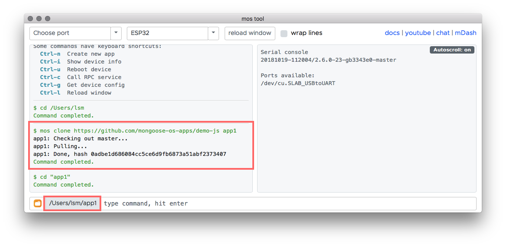


## 5. Build app firmware

Make sure the board is selected. Type `mos build` and press Enter.
That starts a build process that takes up to a minute to complete.
When the command finishes, the built firmware will be located at `build/fw.zip`.
As you can see, we did not make any changes to the app - we'll do that later.


## 6. Flash firmware

Make sure the port is selected in the dropdown menu.
Type `mos flash` and press enter. That will flash a built firmware to the device:

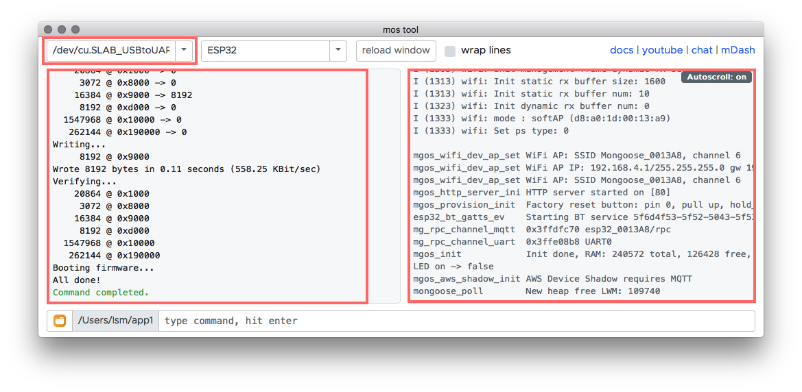

When flashing completes, the firmware starts to write logs to the serial
console. Notice how new messages start to appear in the right window.
The window autoscrolls to the bottom, unless you scroll up manually to see
some previous logs. 

## 7. Configure WiFi

Type command `mos wifi WIFI_NETWORK_NAME WIFI_PASSWORD`. Use your own
network name/password. Press enter. On the serial console, you'll see how
the device reboots after saving new configuration settings, joins the WiFi
network, gets the IP configuration, and synchronises time with SNTP server:

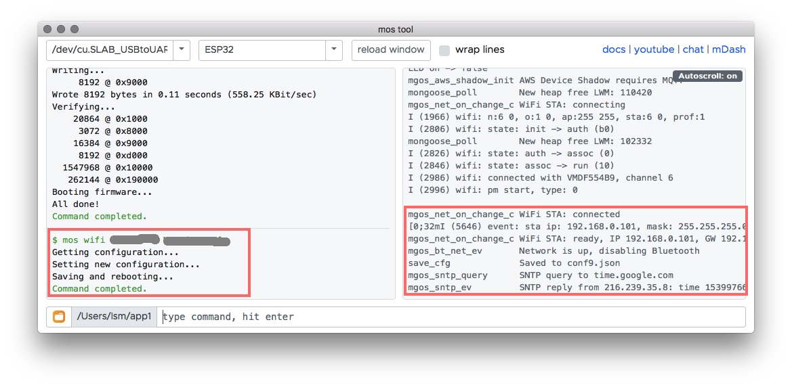


## 8. Add device to the mDash management dashboard

- Login to the mDash at https://mdash.net/. 
- Click on "Add device" button. That'll create a new device:
- Click on a gears icon to trigger device management dialog.
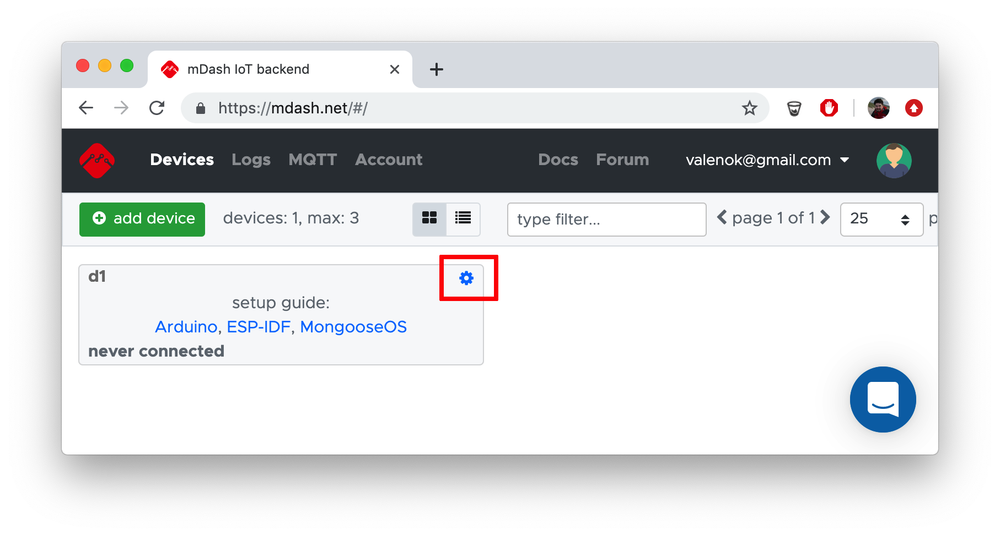
- Click on a "Token" link to copy the device's access token to the clipboard:
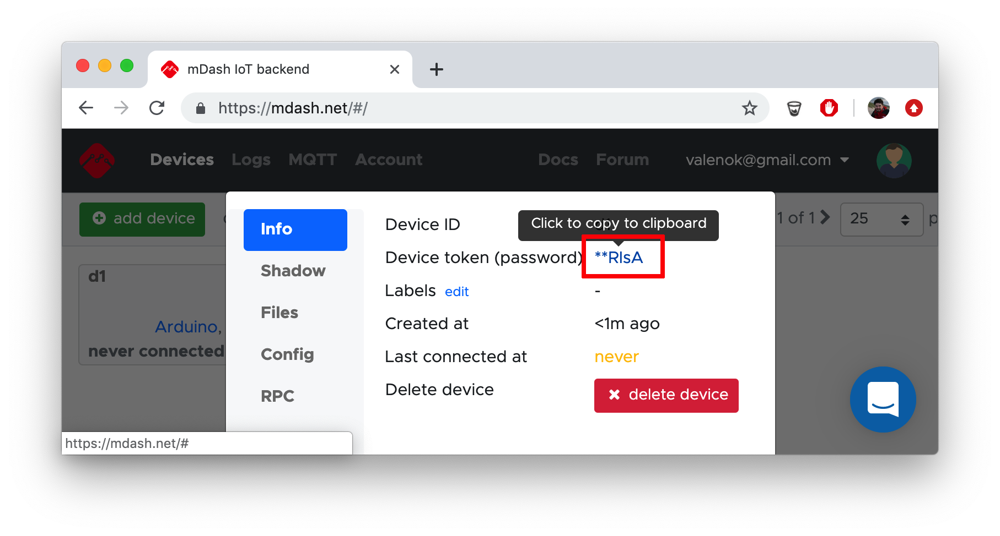

- Go back to the mos tool, type command (change TOKEN to your copied token) and press enter:
  ```
  mos mdash-setup d1 TOKEN
  ```

The `d1` in a command above is device ID.
A device should start to print messages `{"uptime":XX,"on":false}`
to the serial console, and become online:

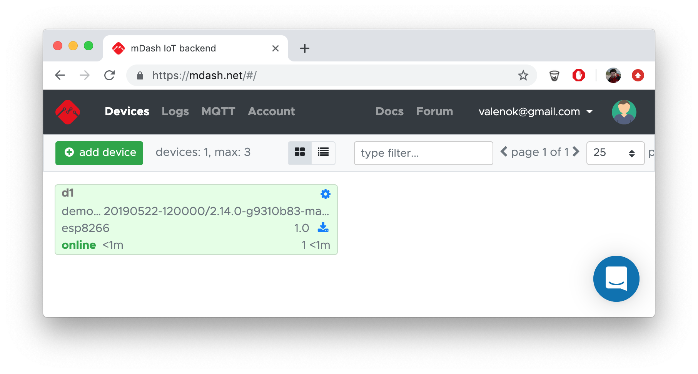

Click on a gears icons to see a management dialong for a device:
general information, configuration editor, file
editor, device shadow editor, and an RPC service call window. We won't study
all these management tools now though, so proceed to the next step.

## 9. Make changes to the firmware

Click on the folder icon on the bottom left corner. That opens a system
file browser in the current app directory. Open `fs/init.js` in your
favorite editor:


Paste this code snippet, that sends an MQTT message every second:

```javascript
load('api_timer.js');
load('api_mqtt.js');

Timer.set(1000, Timer.REPEAT, function() {
	let ok = MQTT.pub('test/topic', 'hello from an updated firmware');
	print('mqtt message sent?', ok);
}, null);
```

Then, rebuild the firmware with `mos build`.


## 10. Update firmware over-the-air

Now let's update our device with the new firmware over the air.

Go to the mDash, click on the firmware update icon:

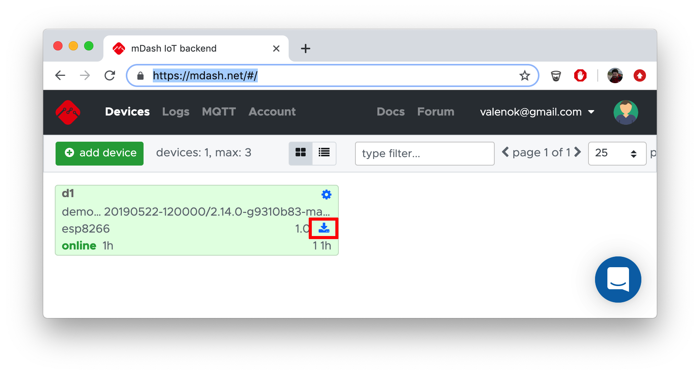

A file dialog should appear. In the file dialog, navigate to the
`app1/build` directory, and choose `fw.zip` file:

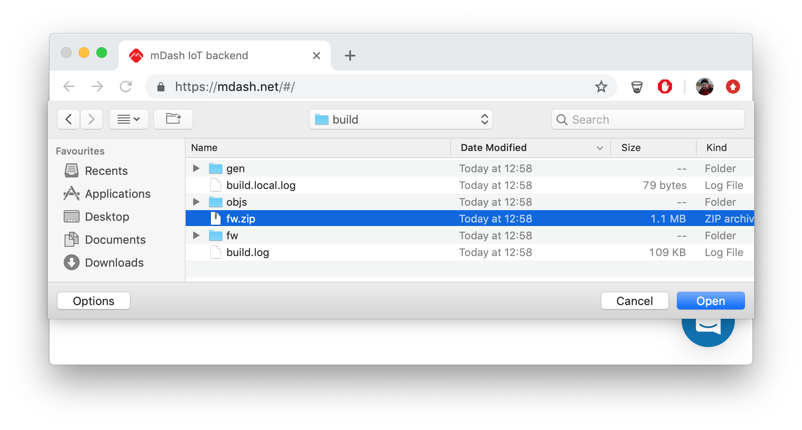

Notice how the progress bar appears showing the OTA progress:

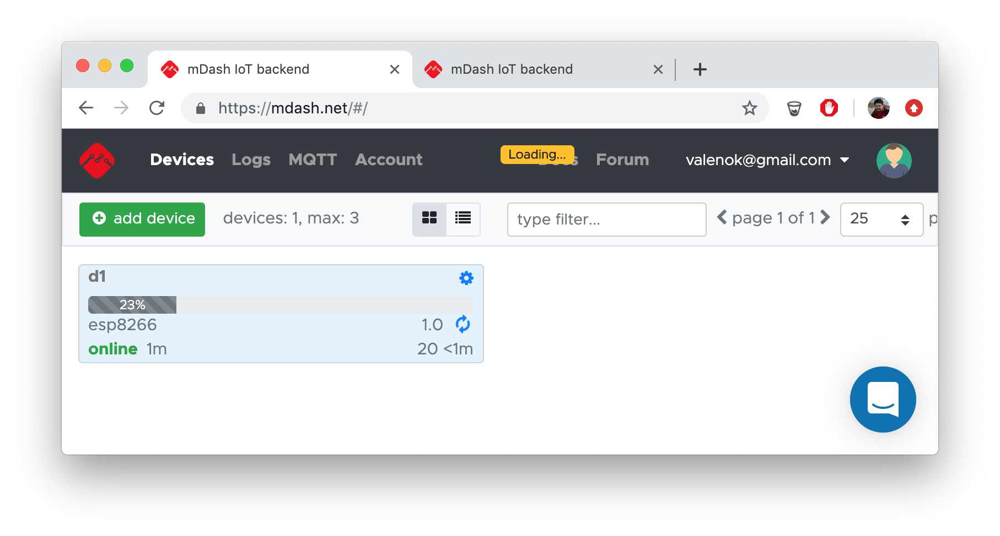

During the OTA process, the device receives chunks of new firmware
from the cloud, and serial console displays that:

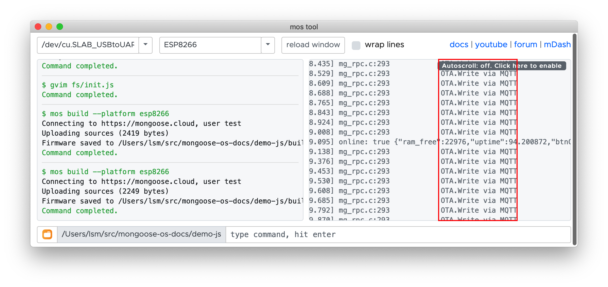

Eventually, the device reboots with the new firmware and we could
see the changed message in the serial console:

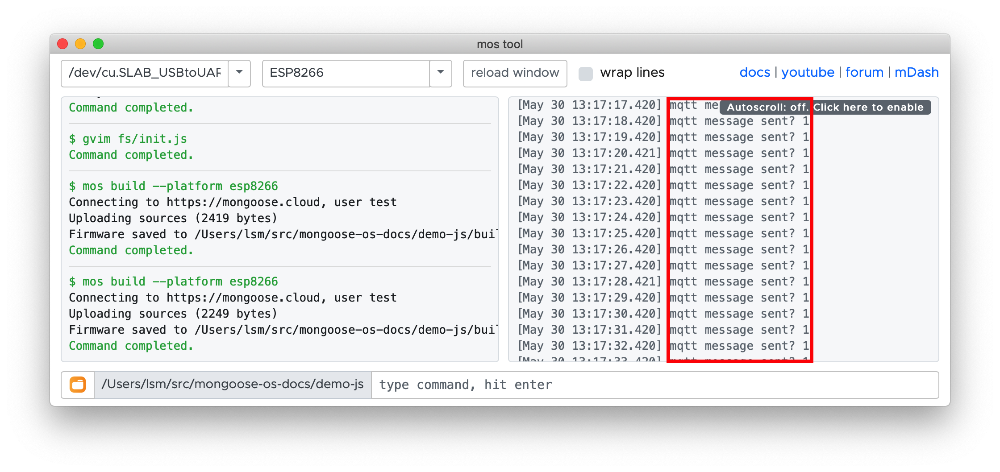


## Next steps

It's time to move on to more advanced topics - learn how to add support
to different hardware peripherals, write logic in both C/C++ and JS,
use API reference, send data to the databases/analytics engines like
Firebase. Proceed to the [advanced guide](/docs/mongoose-os/quickstart/develop-in-c.md).
