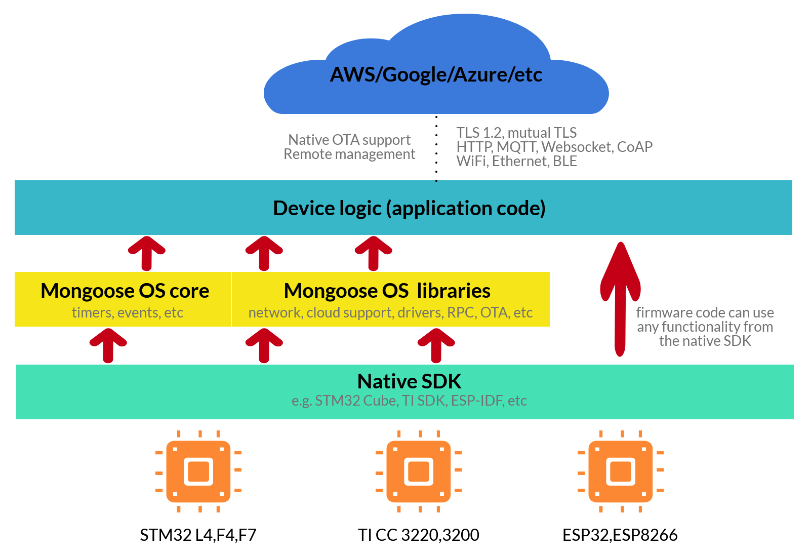

# Introduction

This overview is about the design of
[Mongoose OS](https://mongoose-os.com), a firmware development framework for
connected products. If you are an IoT firmware developer, Mongoose OS is for you.

Here we share our vision and the rationale for the design decisions we made.
The vast majority of these decisions were driven by our work for our customers,
when we developed device firmware to bring their IoT products to the market.

We noticed the following:

1. Each project was a start from scratch, more or less
2. Only ~10-20% of the time was spent on the actual product-specific logic.
  The rest was a generic infrastructure - like configuration, OTA, etc

We refactored those generic pieces that take up to 90% of
firmware development time, into a reusable set of components. We made it
platform-independent - for example, toggling a GPIO code on Mongoose OS looks
the same on all hardware platforms.

The result we called **Mongoose OS**.

Where does the name Mongoose come from?
We are targeting IoT products, where networking is crucial. We use
a mature and trusted
[Mongoose Networking Library](https://github.com/cesanta/mongoose) as
the networking core - that is the origin of the name. The networking library
uses `mg_` prefix for all API functions, and similarly Mongoose OS uses
`mgos_` prefix.

Our goal is to share our experience in the hope that it'll help other
developers to save a great deal of time and effort, reusing a solid and
reliable basis for their products.


# Architecture

## Components

Mongoose OS is a framework for building apps (firmwares) for low-power
microcontrollers (uC), and consists of the following main components:

- A `mos` tool. Provides device management and firmware building capabilities
- A build toolchain. This is a docker image which contains hardware vendor's
  SDK together with mongoose-os sources. A `mos build` command builds a
  firmware (we call it an "app") by taking `mos.yml` file in the current
  directory and invoking a build docker image either remotely (`mos build`)
  or locally (`mos build --local`).
- A collection of ready-to-use **apps** and **libraries**

Mongoose OS is based on the vendor's SDK, it extends the capabilities
of the native SDK. For example, on ESP32 uC, Mongoose OS uses an ESP-IDF SDK,
therefore it provides all capabilities that ESP-IDF provides, plus extra that
come with Mongoose OS. If user code uses crossplatform API only, it can be
built on all supported hardware platforms with no code changes:



If we zoom in the yellow "Mongoose OS" block, it is fragmented into several
components as well. Some of them, like configuration, RPC, timers,
networking API, etc, will be covered further down.

## Source code structure

The Mongoose OS core lives at
[cesanta/mongoose-os](https://github.com/cesanta/mongoose-os) on GitHub:

- [common/](https://github.com/cesanta/mongoose-os/tree/master/common) - various utility functions
- [fw/src/](https://github.com/cesanta/mongoose-os/tree/master/fw/src) - cross-platform API
- [fw/platforms/](https://github.com/cesanta/mongoose-os/tree/master/fw/platforms) - platform-specific code
- [frozen/](https://github.com/cesanta/mongoose-os/tree/master/frozen) - JSON parser/emitter
- [mongoose/](https://github.com/cesanta/mongoose-os/tree/master/mongoose) - networking code

The bulk of the functionality, however, is split into libraries. Each library
is a separate GitHub repository, collected under the
[mongoose-os-libs](https://github.com/mongoose-os-libs) organisation, which
serves as a central repository of libraries.

When documentation is generated, all libraries are traversed and the
"API Reference" part is automatically generated. The `docs:` tag in the
library's `mos.yml` file specifies the documentation category and title.
For example, for the ADC library located at https://github.com/mongoose-os-libs/adc,
the `mos.yml` contains:

```yml
tags:
  - docs:core:ADC
  ...
```

That creates an [API Reference/Core/ADC](../api/core/adc.md)
documentation page. The content is generate from the README.md and header files.


## Boot process

The boot process is driven by a cross-platform
[mgos_init.c](https://github.com/cesanta/mongoose-os/blob/master/fw/src/mgos_init.c).
In short, the subsystems are initialised in the following order:

Native SDK init, GPIO, configuration, WiFi, platform-specific init,
libraries (they can define their initialisation order),
user app init function `mgos_app_init()`,
and at the end - all registered `MGOS_HOOK_INIT_DONE` hooks are invoked.

The initialisation function has the following prototype:

```c
enum mgos_init_result mgos_XXX_init(void);
```

It returns `MGOS_INIT_OK` on success, or any other specific numeric code
on error.

If any of those init functions returns an error,
the firmware reboots immediately. This is done intentionally, in order to
revert back to the previous firmware in case of failed OTA update.


## File system

Mongoose OS implements Virtual File System layer, VFS. That means it can
attach (mount) different storage types into a single file system tree.
For example, a device can have an SPI flash storage and an SD card storage.
For each storage type, a filesystem driver must be implemented. For example,
it is possible to write a driver that implements a Dropbox or Google Drive
storage type, and a device (e.g. ESP8266 module) can mount a Dropbox folder.

Mongoose OS provides a
[Filesystem RPC service](/libraries/remote_management/rpc-service-fs.html)
that allows remote filesystem management - for example,
you can edit files remotely.

The contents of the filesystem depends on the app and specific libraries
that are used. For example, an [mjs](https://github.com/mongoose-os-libs/mjs)
library which adds JavaScript support to the app, also adds a bunch of
`api_*.js` files to the filesystem. Here is a typical layout:

```
conf0.json      - default app configuration, must NOT be edited manually
conf9.json      - user-specific overrides, changed by "mos config-set" command
index.html      - many apps define this file, which is served by a web server
ca.pem          - added by the ca-bundle library, contains ca root certs
init.js         - main file for the JavaScript-enabled apps
api_*.js        - JavaScript API files
api_*.jsc       - compiled JavaScript files
```

# Main event loop

Mongoose OS contains
[Mongoose Networking Library](https://github.com/cesanta/mongoose) as one
of the core components. The networking library provides network protocol
support, such as UDP, MQTT, etc. It consitutes the low level of Mongoose OS;
it is non-blocking and event based, uses `mg_` API prefix and
expects the following usage pattern:

- User creates listening connections by calling `mg_bind()` or variants
- User creates outgoing connections by calling `mg_connect()` or variants
- For all connections, listening or outgoing, user must define an event
  handler function
- All connections are inserted in a linked list in a `struct mg_mgr` structure,
  which is an event manager
- User makes an infinite event loop. On each iteration, Mongoose Networking
  library waits for IO on all connections. When it happens, an event
  handler is called for a appropriate connection

Mongoose OS does exactly that. It defines a "system" event manager instance,
and runs a main event loop in a single task. That event loop dispatches
events by calling event handlers. For example, `mgos_gpio_set_button_handler()`
function sets up a button press event handler. When a hardware interrupt
occurs, its handler queues the event, and the Mongoose OS task calls the
user-defined button handler in its context.

For network connections, Mongoose OS defines wrappers for low-level `mg_`
functions. These wrappers use "system" event manager and provide
the reconnection functionality for the outgoing connection.

For example, low-level `mg_` API for MQTT protocol allows to create an MQTT
client. If it disconnects for any reason, e.g. temporary WiFi connectivity loss,
the connection closes. The `mgos_` wrapper, however, would setup a reconnection
timer with exponential backoff and re-establish the connection automatically.
This is a valuable addon to the low-level `mg_` API, therefore using
`mgos_` API is a good idea. Of course the low level `mg_` API is also available.

You can get main event manager instance by calling `mgos_get_mgr()`
function defined in `mgos_mongoose.h`.

Note that `mgos_` API, as well as `mg_` API, is cross-platform. A firmware
written with that API only, is portable between supported architectures,
as demonstrated by many [example apps](https://mongoose-os/docs/reference/apps.html).
However, the native SDK API is not in any way hidden and is fully available.
For example, one could fire extra FreeRTOS tasks on platforms whose SDK
use FreeRTOS. The price to pay is loss of portability.

# Example footprint

Mongoose OS is highly modular - it is possible to include or exclude
functionality depending on specific needs. That is implemented by the
library mechanism, described later. In order to get a feeling about the
resulting footprint, the table below shows measuremens done on
[TI CC3220SF](http://www.ti.com/product/CC3220)
platform for Mongoose OS 1.18 release, built with different options.
RAM figures are measured after Mongoose OS is initialised, i.e. those numbers
are what is available for the application code.

| Name |  Code Size  | Free RAM | Notes |
| -----| -------------- | ------------- | -------- |
| minimal | 113k |  230k | An [example-no-libs-c](https://github.com/mongoose-os-apps/example-no-libs-c) app. Includes RTOS, TCP/UDP networking core, file system, configuration infrastructure, SNTP  |
| minimal+mjs | 160k | 229k |  Minimal + [mJS JavaScript engine](https://github.com/cesanta/mjs) |
| minimal+aws | 133k | 230k |  Minimal + AWS IoT support |
| minimal+gcp | 159k |  230k |  Minimal + Google IoT Core support |
| js-demo | 304k | 225k | A [default JS demo app](https://github.com/mongoose-os-apps/default). Includes HTTP, MQTT, WebSocket, mDNS networking, RPC subsystem, AWS IoT, Google IoT Core, JavaScript, I2C, SPI, PWM, ADC, and more - see [js-demo-bundle](https://github.com/mongoose-os-libs/js-demo-bundle) library |


<!--
# JavaScript engine
# Timer
 -->
