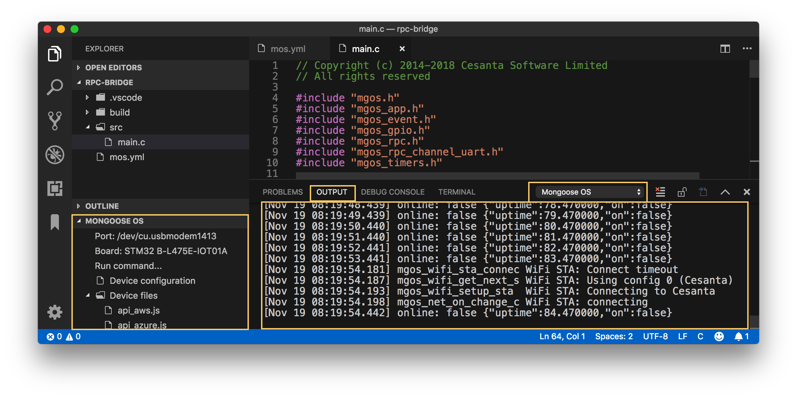

# Mongoose OS IDE

Mongoose OS provides an experimental Visual Studio Code plugin,
that integrates Mongoose OS support into the VSCode.
To install it, run VSCode, search and install a "Mongoose OS IDE" extenstion:

