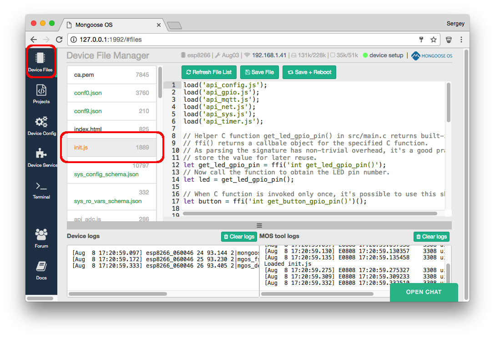

# Starting with JavaScript

Connect your device to your computer via the USB cable.
Start `mos` by double-clicking the executable or by typing `mos` in your
Linux or Mac terminal. This will start a simple Web UI. The drop-down list
for the device address must list the corresponding serial device.
If it does not, go back to the [downloads page](/software.html) and install
USB-to-Serial drivers.

Select serial device from the dropdown list, click on Connect button,
choose your device architecture, flash the firmware and configure wifi:

This will flash the pre-built firmware called **default**
(you can see the [full list here](/apps.html)). This particular firmware
(we call it **an app**) has many capabilities built-in. One of which
is an [mJS library](https://github.com/cesanta/mjs) that adds JavaScript
prototyping ability.

A firmware with JavaScript supports loads `init.js` file after boot,
therefore if you needs to customise a default app, you need to modify
that file and reboot the device. Let's do it.

Click on "Device files" tab, and click on `init.js` file in the list:

This default code does several things: sets up a timer to blink a built-in
LED if your device has it, sets up a button press handler that sends an
message to an MQTT server on a button press, etc.

Modify a blinking interval from 1 second to 100 millisecond, click on
"Save and Reboot" button, and see notice the change in the blinking speed:

Note that the firmware has not been modified. What was modified is a file
`init.js` on the filesystem, which gets loaded after firmware boot and
JavaScript engine interprets it. This demonstrates the ability to modify
the behavior of the built firmware using JavaScript.

You can play with the other JavaScript API - take a look at the
`api_*.js` files present on a device to get an idea what API is available
in the default app. If you need other API, for example some specific
sensor, you will need to include appropriate library and rebuild the app,
which is subject of the following sections. However, the default app
provides quite broad functionality in terms of accessing hardware
(e.g. PWM, GPIO, I2C, etc) and cloud integrations (e.g. AWS IoT).
