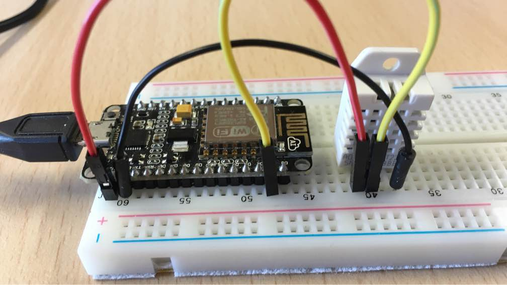

# Starting with C/C++

In this section we will learn how to build a firmware from scratch, using
C/C++ API. For this, we'll use command line rather than Web UI.

We will build an app that uses DHT22 temperature/humidity sensor, and
allows to read sensor values remotely. Start terminal if you are on
Mac or Linux. If you're on Windows, start command prompt, and make a copy
of the `empty` Mongoose OS app, which is a bare-bones app used as an app
template. Here and below we assume Mac/Linux system:


## Clone template project

<pre class="command-line language-bash" data-user="chris" data-host="localhost" data-output="2-5"><code>git clone https://github.com/mongoose-os-apps/empty my-app
Cloning into 'my-app'...
remote: Counting objects: 68, done.
remote: Total 68 (delta 0), reused 0 (delta 0), pack-reused 68
Unpacking objects: 100% (68/68), done.
cd my-app</code></pre>

See what files we have:

<pre class="command-line language-bash" data-user="chris" data-host="localhost" data-output="2-100"><code>find .
.
./fs
./fs/index.html
./mos.yml
./README.md
./src
./src/main.c</code></pre>

The two important files we'll be dealing with is `mos.yml` which
describes how to build an app and `src/main.c` which is going to have
our C code.

## Add necessary libraries

Open `mos.yml` file in your favorite editor and add support for DHT sensor:

```yaml
libs:
  - origin: https://github.com/mongoose-os-libs/rpc-service-config
  - origin: https://github.com/mongoose-os-libs/rpc-service-fs
  - origin: https://github.com/mongoose-os-libs/rpc-uart
  - origin: https://github.com/mongoose-os-libs/wifi
  - origin: https://github.com/mongoose-os-libs/dht  # <-- Add this line!
```

Note - all available libraries are collected under the https://github.com/mongoose-os-libs organisation, so you can browse it
The "API Reference" section provides an easy to use navigation over those
libraries and their API. Now, open `src/main.c`, you'll see the following
skeleton code which initialises an app that does nothing:

```c
#include "mgos.h"

enum mgos_app_init_result mgos_app_init(void) {
  return MGOS_APP_INIT_SUCCESS;
}
```

## Create custom configuration section

Let's add a code that reads from a DHT temperature sensor every second.
The pin to which a sensor is attached, we make configurable by editing
a `config_schema:` section in the `mos.yml`, to have it like this:

```yaml
config_schema:
 - ["app", "o", {title: "My app custom settings"}]
 - ["app.pin", "i", 5, {title: "GPIO pin a sensor is attached to"}]
```

This custom configuration section will allow us to change sensor pin
at run time, without recompiling firmware. That could be done programmatically
or via the `mos` tool, e.g. `mos config-set app.pin=42`.

## Add code that uses sensor library

Then, edit `src/main.c`, add a timer (see [timer api docs](/docs/libraries/core/timer.html)) that reads DHT and logs the value
(error handling is intentionally omitted):

```c
#include "mgos.h"
#include "mgos_dht.h"

static void timer_cb(void *dht) {
  LOG(LL_INFO, ("Temperature: %lf", mgos_dht_get_temp(dht)));
}

enum mgos_app_init_result mgos_app_init(void) {
  struct mgos_dht *dht = mgos_dht_create(mgos_sys_config_get_app_pin(), DHT22);
  mgos_set_timer(1000, true, timer_cb, dht);
  return MGOS_APP_INIT_SUCCESS;
}

```

## Build the app and test sensor reading

Connect DHT sensor to pin 5. The sensor itself has following pins:


This is an example with ESP8266 NodeMCU. Red connector is VCC 3.3 volts, black
connector is ground GND, and yellow is data, connected to pin 5:



Build, flash the firmware, and attach the
console to see device logs. Assume we're working with ESP8266:

<pre class="command-line language-bash" data-user="chris" data-host="localhost" data-output="2-4,6-20,22-30"><code>mos build --arch esp8266
Connecting to https://mongoose.cloud, user test
Uploading sources (1506 bytes)
Firmware saved to build/fw.zip
mos flash
Loaded my-app/esp8266 version 1.0 (20170809-062613/???)
Using port /dev/cu.SLAB_USBtoUART
Opening /dev/cu.SLAB_USBtoUART @ 115200...
Connecting to ESP8266 ROM, attempt 1 of 10...
  Connected
Running flasher @ 1500000...
  Flasher is running
Flash size: 4194304, params: 0x0240 (dio,32m,40m)
Deduping...
     2656 @ 0x0 -> 0
...
     4096 @ 0x3fb000
      128 @ 0x3fc000
Booting firmware...
All done!
mos console
...
[Aug  9 08:35:52.871] mgos_init            Init done, RAM: 53184 total, 46248 free, 45696 min free
[Aug  9 08:35:52.880] mongoose_poll        New heap free LWM: 45440
[Aug  9 08:35:53.889] timer_cb             Temperature: 18.6
...</code></pre>

Console log shows sensor reading appearing in 1-second intervals. Press
`Ctrl-C` to quit the console.

## Add RPC service to read sensor data remotely

Now let's use the cornerstone of Mongoose OS remote management capabilities.
We can make any hardware function be remotely accessible. This is done
by creating an RPC service. Read more about it in the Overview and Core
libraries sections, and here we jump straight to it. Looking at
[MG-RPC API doc](), add RPC service `Temp.Read`:

```c
#include "mgos.h"
#include "mgos_dht.h"
#include "mgos_rpc.h"

static void timer_cb(void *dht) {
  LOG(LL_INFO, ("Temperature: %lf", mgos_dht_get_temp(dht)));
}

static void rpc_cb(struct mg_rpc_request_info *ri, void *cb_arg,
                   struct mg_rpc_frame_info *fi, struct mg_str args) {
  mg_rpc_send_responsef(ri, "{value: %lf}", mgos_dht_get_temp(cb_arg));
  (void) fi;
  (void) args;
}

enum mgos_app_init_result mgos_app_init(void) {
  struct mgos_dht *dht = mgos_dht_create(mgos_sys_config_get_app_pin(), DHT22);
  mgos_set_timer(1000, true, timer_cb, dht);
  mg_rpc_add_handler(mgos_rpc_get_global(), "Temp.Read", "", rpc_cb, dht);
  return MGOS_APP_INIT_SUCCESS;
}
```

## Build and test the final app

Build and flash the app:

<pre class="command-line language-bash" data-user="chris" data-host="localhost" data-output="2-100"><code>mos build --arch esp8266 && mos flash</code></pre>

And now, call the device's RPC service:

<pre class="command-line language-bash" data-user="chris" data-host="localhost" data-output="2-100"><code>mos call Temp.Read
{"value": 18.6}</code></pre>

This call could be performed over the serial connection as well as over
network connection - see [RPC section](/docs/overview/rpc.html) to learn more.

To summarise, this section demonstrates how to use C/C++ API, libraries,
custom configuration, and MG-RPC remote management mechanism.
