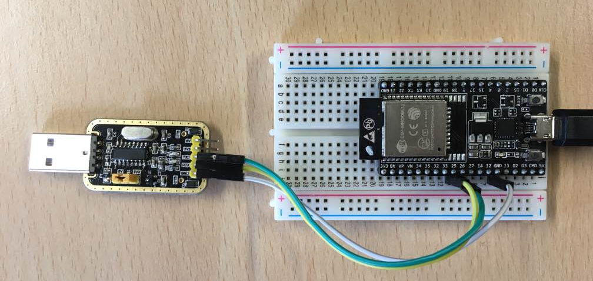
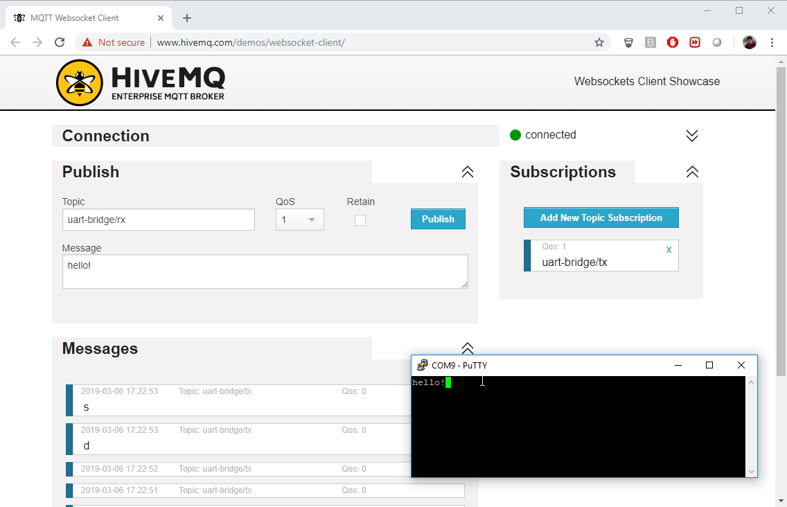
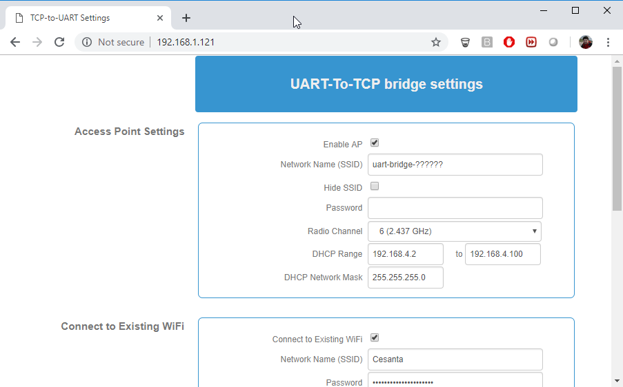

# UART gateway

## Introduction

UART gateway connects any device to the Internet via UART.
Everything that your device sends to the UART, the gateway forwards
to the Internet server - for example, AWS IoT, or
Azure, or your own private TCP / Websocket backend.
Likewise, everything that is sent to the gateway, gateway forwards
to the UART.

The UART gateway could report to the BLE central, to the raw TCP server,
to the Websocket server, and to the MQTT server. Also, it can accept
an incoming TCP/Websocket connections. Thus it is very versatile in terms
of the connection options.

UART gateway does not implement any logic whilst forwarding data to and
from the UART. Data is transferred as-is, no modification happens
in any direction. Message boundaries are determined by timing.

Authentication and encryption is provided by the TLS layer.
The server side must be a TLS1.2 server with client-side
authentication (mutual TLS) for the industry-standard level of security.
AWS IoT is an example of such service.

## Quick start

1. Buy hardware mentioned on the [Uart gateway page](/uart-gateway/)
2. Connect hardware to your workstation via USB
3. Follow steps 1,2,3 of [mos setup](https://mongoose-os.com/docs/quickstart/setup.md)
4. In the `mos` UI, run `mos flash https://mongoose-os.com/downloads/uart-gateway/uart-gateway.zip` command
5. Follow step 7 of [mos setup](https://mongoose-os.com/docs/quickstart/setup.md)
6. Login to the [license manager](https://license.mongoose-os.com) and buy uart-gateway licenses (one per device)
7. Execute `mos license`
8. Configure MQTT:
   - For generic/private MQTT server, run
   ```
   mos config-set mqtt.enable=true mqtt.server=HOST:PORT tu.mqtt.enable=true
   ```
   - For AWS, follow [AWS guide's](/docs/quickstart/cloud/aws.md) "Setup AWS IoT" and "Setup device" chapters
   - For Google, follow [GCP guide's](/docs/quickstart/cloud/google.md) "Setup Google IoT Core" and "Setup device" chapters
   - For Azure, follow [Azure guide's](/docs/quickstart/cloud/azure.md) "Setup Azure IoT Hub" and "Setup device" chapters
   - For Watson, follow [Watson guide's](/docs/quickstart/cloud/watson.md) "Quick setup" chapter
   - For [mDash](https://dash.mongoose-os.com), follow step 8 of [mos setup](https://mongoose-os.com/docs/quickstart/setup.md)
9. Connect UART: pin 25 to TX, pin 26 to RX

When done, you should have your device flashed, provisioned to WiFi,
connected to the cloud, and reporting UART data. Below is an example
of the eval ESP32 Devkit-C board that connects a USB-to-Serial,
making computer's serial device controlled via MQTT:



| USB-to-Serial converter |  UART gateway on ESP32 Devkit-C |
| ----------------------- | ------------------------------- |
| GND | GND  |
| RX  | IO25 |
| TX  | IO26 |

reporting data to the http://www.mqtt-dashboard.com:



## Configuring UART gateway

UART gateway keeps its configuration on a flash filesystem. It could be instected
and changed using `mos` tool. To see an existing configuration,
execute `mos config-get`. Below is the documentation for relevant entries:

```javascript
"tu": {
  "bt": {                           // BLE settings
    "rx_buf_size": 2048,            // BLE RX buffer size
    "tx_buf_size": 2048             // BLE TX buffer size
  },
  "evict_old": true,
  "mqtt": {                         // MQTT settings
    "enable": true,                 // Enable MQTT
    "qos": 0,                       // MQTT publishing QoS
    "rx_topic": "uart-bridge/rx",   // RX topic
    "tx_topic": "uart-bridge/tx"    // TX topic
  }
},
"tcp": {                            // TCP/Websocket  settings
  "client": {                                 // Client mode
    "reconnect_interval": 5,                  // Reconnection interval, seconds
    "remote_addr": "mongoose-os.com:443",     // Server HOST:PORT
    "tls": {                                  // TLS settings
      "ca_cert": "ca.pem",
      "cert": "",
      "server_name": "mongoose-os.com"
    },
    "ws": {
      "enable": true,                         // Enable websocket mode
      "protocol": "",
      "uri": "/uart-to-websocket/device/????????????"   // URI to connect to
    }
  },
  "evict_old": true,                // On device ID conflict, evict old entry
  "keepalive": {                    // Heartbeat settings
    "count": 10,
    "idle": 60,
    "interval": 6
  },
  "listener": {                     // Server mode settings
    "port": 8910,                   // Port to listen on
    "tls": {                        // TLS settings
      "ca_cert": "",                // CA certificate for mutual auth
      "cert": ""                    // Server certificate
    },
    "ws": {
      "enable": false               // Enable websocket mode
    }
  },
  "rx_buf_size": 2048,              // Receive buffer size, bytes
  "status_interval_ms": 1000,       // Status interval, milliseconds
  "tx_buf_size": 2048               // Transmit buffer size, bytes
},
"uart": {                           // UART settings
  "baud_rate": 115200,              // Baud rate
  "rx_buf_size": 1460,              // Receive buffer size, bytes
  "rx_fc_ena": false,               // Enable flow control
  "rx_linger_micros": 20,           // Microseconds to continue reading before sending
  "rx_throttle_when_no_net": true,  // Throttle when no network
  "status_interval_ms": 1000,       // Status interval, milliseconds
  "swap_rxcts_txrts": false,        // Swap RX / CTS and TX / RTS
  "tx_buf_size": 2048,              // Transmit buffer size
  "tx_fc_ena": false,               // Enable TX flow control
  "uart_no": -1                     // UART number, -1 to disable
}
```

In order to change any configuration parameter, execute `mos config-set name=value`, for example:

```
mos config-set mqtt.server=my.server.com:1883
mos config-set kiwi.pub_topic=my_cool_topic
```

## Web UI

UART gateway, when not configured, starts its own WiFi Access Point,
named `uart-gateway-......`. The gateway is accessible on IP address
`192.168.4.1` in that network.

If WiFi station is configured, then the UART gateway does not start an
access point.

In any case, UART gateway runs a Web UI on port 80, allowing to setup
tunable parameters over the easy-to-use interface:


