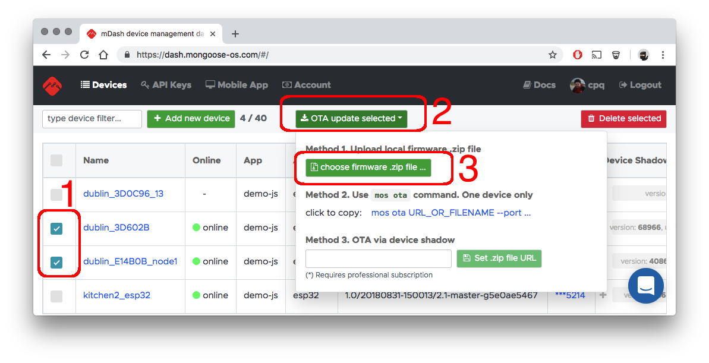
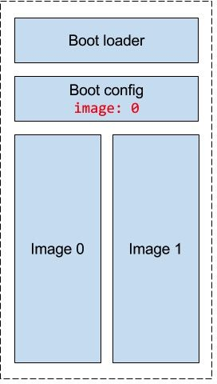
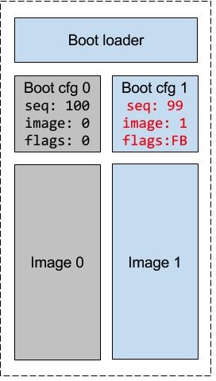

# OTA - Over The Air firmware update

## OTA using `mos ota` command

This is the most universal OTA method. It works over any transport:
serial connection, BLE, MQTT, Websocket, etc.

```
mos --port DEVICE_ADDRESS ota FIRMWARE_FILENAME_OR_URL
```

## OTA using management dashboard file upload

This method is the simplest one. Build, or download a new firmware.
Then, open a management dashboard, select devices you want to
update, and upload a .zip file using the Web UI:




## OTA by calling `OTA.Update` device RPC

```
mos --port DEVICE_ADDRESS ota FIRMWARE_FILENAME_OR_URL
```

## OTA using `OTA.Update` RPC call

This method works by downloading a new firmware over HTTP.
NOTE: this method requires professional subscription.

```
mos --port DEVICE_ADDRESS call RPC.Update '{"url": "URL_TO_ZIP"}'
```

## OTA using device shadow

This method works by setting a `desired.ota.url` shadow parameter.
As soon as a device comes online, it picks up the change, and
downloads the new firmware. NOTE: this method requires professional subscription.

This method works on [mDash](https://dash.mongoose-os.com), AWS IoT, Microsoft Azure.
Just change the device shadow manually or programmatically - here is an example
of the mDash online shadow editor:


## OTA using HTTP POST

This method is for development. It works only if the device is directly
visible. In order to enable HTTP POST OTA handler, include
[ota-http-server](https://github.com/mongoose-os-libs/ota-http-server)
library in your `mos.yml`. Then, you
can build a new firmware and push it using this command:

```
curl -v -F file=@build/fw.zip http://IP_ADDR/update
```


## OTA architecture overview

OTA implementation in Mongoose OS has 3 layers:

-  **Layer 1.** The lowest layer, implemented by  the [ota-common](https://github.com/mongoose-os-libs/ota-common)
   library. The API functions that do the work are
   `updater_context_create()` to start an update, a sequence of
   `updater_process()` to apply the
   next chunk of firmware, and `updater_finish()` to finish the update.
-  **Layer 2.** The RPC service that provides a remote management API for the
   low-level OTA API. It is implemented by the [rpc-service-ota](https://github.com/mongoose-os-libs/rpc-service-ota)
   library. The RPC API are of two kinds: push and pull.
   * `OTA.Update` is a pull mechanism. Works only via HTTP.
   You pass a URL to the new .zip file as a parameter of the RPC call,
   the .zip file gets downloaded and low-level API calls apply it.
   * `OTA.{Begin,Write,End}` is a push mechanism. It works over any transport,
   for example, BLE, or MQTT. They are calling corresponding
   low-level API.
-  **Layer 3.** Helper libraries and tools that invoke the 2nd RPC layer,
   * `mos ota` command calls the "push" RPC, and can work over any transport
   by specifying the `--port ...` parameter. That is the most universal method.
   * [ota-http-client](https://github.com/mongoose-os-libs/ota-http-client)
   library is able to fetch firmware from a URL. This library is in fact
   used by the `OTA.Update` RPC implementation. Also, this library is able
   to periodically poll a given URL for the new version of firmware,
   and auto-update.
   * [ota-http-server](https://github.com/mongoose-os-libs/ota-http-server) library
   registers and `/update` URI handler directly on a device. You can push
   the new firmware over the HTTP POST. This method is for the development
   purposes: `curl -v -i -F filedata=@fw.zip http://IPADDR/update`
   * [ota-shadow](https://github.com/mongoose-os-libs/ota-shadow) library
   observes `desired.ota.url` shadow changes. If it gets a new URL,
   it triggers the `OTA.Update` with that URL. This method works for the
   offline devices - you can change the shadow of the number of devices, and
   they will get updated as soon as they come online.


## Commit timeout

When a new firmware boots, it can hang or crash for various reasons.
It can happen on one of a thousands devices, but still you don't want
it to happen on a customer site. The concept of commit timeout is
a solution for this problem that makes OTA process reliable - you can
push a very untested, dodgy firmware on a production device, and it will
roll back if there is any problem.

It works this way: first of, the OTA process never mutates the existing
flash partition. OTA-ed firmware and filesystem gets copied to the
new partition without touching an existing one.

Secondly, a new firmware boots from a flash partition that is
marked "dirty". When a boot loaded sees a "dirty" flag, it start
a hardware timer that triggers after `commit_timeout` seconds.
If a "dirty" flag is still present when a timer kicks in, a boot loader
regards a firmware bad and reboots back into an old partition.

Thus, a commit timeout feature gives a "verification period" during
which a decision is made whether a new firmware is good or not.
Clearing the dirty flag is done by the `OTA.Commit` call, and could be
done either manually or automatically. If the firmware hangs, or crashes
before the dirty flag is cleared, the next reboot will roll back.

NOTE: the commit timeout support requires professional subscription.

## Implementation details

The main design principle of the OTA mechanims is reliability: never end up with
a bricked device, roll back on any failure. Therefore, an OTA process never
updates firmware code or data in-place. Any failure (e.g. power
loss) can end up in broken device. Thus, an OTA mechanism uses independent
self-contained flash paritions to hold firmware images (code and data), and
an intelligent boot loader makes a decision which partition to boot:



Here is a high level overview of the OTA procedure:

1. OTA is triggered via one of the many supported methods:
   HTTP POST request,
   [periodic timer that polls well known location](https://github.com/mongoose-os-libs/ota-http-client),
   [AWS IoT device shadow change](https://github.com/mongoose-os-libs/ota-aws-shadow),
   an [`OTA.Update` RPC command](https://github.com/mongoose-os-libs/rpc-service-ota), or other.
   You can create your method using an [OTA API](https://github.com/mongoose-os-libs/ota-common/tree/master/include).
2. A separate flash partition is created to hold a new firmware image - code
   and data (root filesystem).
3. A new firmware image is downloaded to the new flash partition. Any failure
   during that process aborts an OTA.
4. When new firmware image is successfully copied,
  - All files from the old FS that do not exist in the new FS, are
    moved to the new FS. This is an important mechanism of preserving user
    data and device-specific configuration, like `conf2.json` - `conf9.json`
    configuration files, or any other files. Remember: if a firmware image
    contains a file, it'll override an existing file during OTA.
    Never put files like `conf9.json` in your firmware.
  - Boot loader configuration is updated, saying that a new partition exists
    and the boot loader must boot from it. A new partition is marked dirty,
    and the "commit interval" time is stored in the boot configuration.
5. Device reboots. Boot loader boots the new partition. It figures out from
   the boot configuration that that partition is dirty, unsafe, because the
   "commit" flag is not set. Therefore it starts the hardware timer that will
   fire after the "commit interval", and executes the new image.
6. The new image start, performs a usual boot sequence. At some point
   a `mgos_upd_commit()` is called, which sets a "commit" flag in the
   boot config, marking this firmware "OK". A commit call could be done
   automatically after the health-checks, or manually by the user.
   If the commit is not made, a boot config still has "commit" flag not set.
7. A boot loader timer handler kicks in. It checks the commit flag. If it is set,
   it silently exits. If not set, i.e. the firmware is still dirty, the
   rollback is performed: the image to boot, and commit flag are
   set to their previous values, and device reboots.

The in-depth example of the OTA on CC3200 is given at
[embedded.com article - Updating firmware reliably](https://www.embedded.com/design/prototyping-and-development/4443082/Updating-firmware-reliably)

## Boot configuration section

If the boot config is stored in only one location,
it makes it susceptible to failure during updates, which are usually performed
as a read-erase-write operation: a reboot after erase and before write is
complete could render device unbootable. The time between the two is short,
but we set out to make our update process safe at all points, so we have
to deal with it. The way we do it by using two config files with versioning,
or sequencing. A sequencer is a monotonically decreasing number, so of the
two files the one with smaller sequencer is more recent - on figure 2,
config 1 is selected as active because it has smaller sequencer.
When writing a new config file, we always use the currently inactive
(older) slot and it will not become newer until it is written - erased
config will be older than any valid one because erased NOR flash is
filled with all 1s:


